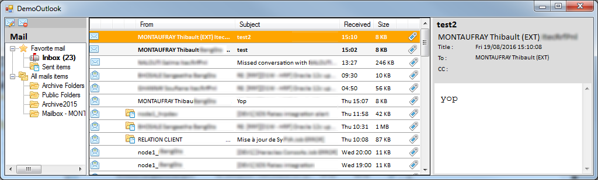

[](https://www.nuget.org/packages/Droid_Communication/)  [](https://ci.appveyor.com/project/ThibaultMontaufray/Droid-communication) [](https://travis-ci.org/ThibaultMontaufray/Droid-Communication) [](https://coveralls.io/github/ThibaultMontaufray/Droid-Communication?branch=master) [](http://94.247.180.137:8080/job/CI-Droid-Communication/)

# Manager Communication [](http://servodroid.com)

This module allow your programms to make communications with those tools :
 - outlook (all mails in futur version)
 - slack
 - lync (code cleanin in progress)
 
If you need more tools in that library, don't hesitate to ask me to add them.

# Usage

Launch slack demo  : 
```chsarp
Application.Run(new SlackDemo());
```

Launch outlook demo : 
```chsarp
Application.Run(new OutlookDemo());
```

# Demo


